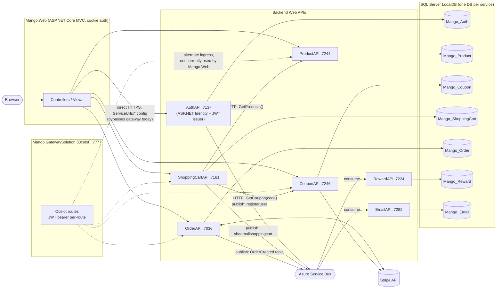

# Architecture

Mango is a .NET 8 microservices e-commerce system: one MVC web client, an Ocelot API gateway, six independent Web APIs (each owning its own SQL Server database), a shared message-bus abstraction over Azure Service Bus, and Stripe for payments.

## System diagram

## Components

| Project | Role | Port (HTTPS, dev) |
|---|---|---|
| `Mango.Web` | ASP.NET Core MVC client; cookie-based sign-in; the only user-facing app | 7207 |
| `Mango.GatewaySolution` | Ocelot reverse proxy/API gateway with per-route JWT auth | 7777 |
| `Mango.Services.AuthAPI` | Identity, registration, login, JWT issuance, role assignment | 7137 |
| `Mango.Services.ProductAPI` | Product catalog CRUD + image upload | 7244 |
| `Mango.Services.CouponAPI` | Coupon CRUD, mirrors coupons into Stripe | 7246 |
| `Mango.Services.ShoppingCartAPI` | Cart header/detail management, coupon application, composes product data | 7181 |
| `Mango.Services.OrderAPI` | Order creation, Stripe Checkout session + payment validation, order status/refunds | 7036 |
| `Mango.Services.RewardAPI` | Awards reward points from completed orders (async consumer) | 7224 |
| `Mango.Services.EmailAPI` | Sends/logs cart, registration, and order emails (async consumer) | 7282 |
| `Mango.MessageBus` | Shared `IMessageBus.PublishMessage()` wrapper over `Azure.Messaging.ServiceBus`, referenced by publishers and consumers | — |

Each `Mango.Services.*API` project follows the same internal shape: `Controllers/`, `Data/AppDbContext.cs`, `Models/` + `Models/Dto/`, `MappingConfig.cs` (AutoMapper), `Migrations/`, and `Extensions/WebApplicationBuilderExtensions.cs` exposing `AddAppAuthetication()`.

## Cross-cutting concerns

**Authentication.** `AuthAPI` is the only service backed by ASP.NET Core Identity (`ApplicationUser : IdentityUser`, roles `ADMIN` / `CUSTOMER`). It signs a JWT with a shared symmetric secret (`ApiSettings:JwtOptions:Secret` / `ApiSettings:Secret` depending on the service — **the literal secret string must be identical across every service and the gateway**, since each one independently validates the token via `AddAppAuthetication()` rather than calling AuthAPI). `Mango.Web` stores the JWT in a cookie (`TokenProvider`) and attaches it as a bearer token on every outgoing API call (`BaseService.SendAsync`).

**Two ingress paths, only one in active use.** `Mango.Web`'s `Program.cs` sets `SD.*APIBase` from `ServiceUrls:*` and calls backend services directly over HTTPS — it does not route through the Ocelot gateway. The gateway (`Mango.GatewaySolution/ocelot.json`) independently maps `/api/{service}/...` to the same backend ports and enforces `AuthenticationProviderKey: "Bearer"` per route. Treat the gateway as a documented-but-unused alternate entry point unless/until `Mango.Web` (or another client) is pointed at `https://localhost:7777`.

**Service-to-service HTTP calls.** `ShoppingCartAPI` calls `ProductAPI` (`GET /api/product`) to enrich cart lines with price/name, and `CouponAPI` (`GET /api/coupon/GetByCode/{code}`) to price a coupon. These calls use named `HttpClient`s (`"Product"`, `"Coupon"`) with `BackendApiAuthenticationHttpClientHandler`, a `DelegatingHandler` that forwards the *caller's own bearer token* from `HttpContext` — so these calls only work inside an authenticated request, and the downstream service enforces the same role/claim checks it would for a direct client call. `OrderAPI` has an unused `IProductService`/`"Product"` `HttpClient` wired up but never calls it — order line-item data (name/price) is instead carried through from the cart snapshot captured at checkout time and never re-validated against the live catalog.

**Asynchronous messaging (`Mango.MessageBus` over Azure Service Bus).**

| Topic / Queue | Config key | Publisher | Consumer(s) |
|---|---|---|---|
| `registeruser` | `TopicAndQueueNames:RegisterUserQueue` | AuthAPI (`Register`) | EmailAPI |
| `sbqemailshoppingcart` | `TopicAndQueueNames:EmailShoppingCartQueue` | ShoppingCartAPI (`EmailCartRequest`) | EmailAPI |
| `OrderCreated` (topic) / `OrderCreatedRewardsUpdate` (subscription) | `TopicAndQueueNames:OrderCreatedTopic` / `OrderCreated_Rewards_Subscription` | OrderAPI (`ValidateStripeSession`, on successful payment) | RewardAPI |

Despite the topic's name, it fires on **successful payment confirmation**, not on order creation. See [`workflows/rewards-and-notifications.md`](workflows/rewards-and-notifications.md) for message shapes and a caveat: RewardAPI defines a full `IAzureServiceBusConsumer` but its `Program.cs` never registers or starts it, so reward points are not actually credited as the code stands.

**Payments.** Stripe is wired into two services independently (`Stripe.StripeConfiguration.ApiKey` set from `Stripe:SecretKey` in each): `CouponAPI` mirrors every coupon CRUD op into Stripe's `Coupon` API so codes can be redeemed at Checkout, and `OrderAPI` owns the actual Checkout Session / PaymentIntent / Refund lifecycle.

**Response contract.** Every controller action returns `ResponseDto { bool IsSuccess, string Message, object Result }`. `Mango.Web`'s `BaseService.SendAsync` deserializes this envelope and maps common HTTP status codes (401/403/404/500) to a friendly `Message`.

**DTO boundary.** Every service keeps EF entities (`Models/*`) separate from wire types (`Models/Dto/*`), mapped by AutoMapper profiles in `MappingConfig.cs`. `Mango.Web/Models/*Dto.cs` mirrors these shapes on the client side. Changing a field means touching the entity, the DTO, the AutoMapper profile, and the Web-side DTO/view together.

## Known gaps worth knowing before you touch this code

- **RewardAPI's Service Bus consumer is dead code.** `Mango.Services.RewardAPI/Program.cs` never calls `AddSingleton<IAzureServiceBusConsumer, AzureServiceBusConsumer>()` nor `app.UseAzureServiceBusConsumer()` (contrast with `EmailAPI/Program.cs`, which does both). The `OrderCreatedRewardsUpdate` subscription is never drained by a running process.
- **Gateway is unused by the web client.** See above — don't assume changing `ocelot.json` affects what a user sees in the browser today.
- **Order line items are a point-in-time snapshot.** `OrderAPI.CreateOrder` trusts the `CartDto` posted by the client for prices/names; it does not re-fetch from `ProductAPI`.
