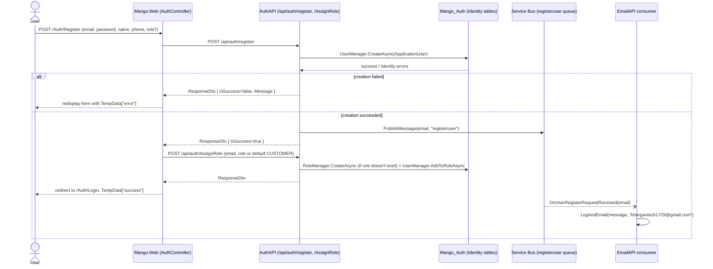

# Workflow: Authentication (register / login / role-based access)

**Services involved:** `Mango.Web` → `Mango.Services.AuthAPI` → Azure Service Bus → `Mango.Services.EmailAPI`

## Registration



Notes:
- If no role is submitted, `Mango.Web/Controllers/AuthController.cs` defaults it to `SD.RoleCustomer`.
- The role-assignment call is a **second**, separate HTTP round trip after registration succeeds — if it fails, the user account still exists without a role.
- `EmailAPI`'s `RegisterUserEmailAndLog` currently hardcodes the notification recipient to `bhargavtech1729@gmail.com` rather than the registering user's own address — this looks like a leftover from development, not an intentional "notify support" design (worth confirming before treating it as correct behavior for a fork of this codebase).

## Login

```mermaid
sequenceDiagram
    actor U as User
    participant Web as Mango.Web (AuthController)
    participant Auth as AuthAPI (/api/auth/login)
    participant DB as Mango_Auth

    U->>Web: POST /Auth/Login (username, password)
    Web->>Auth: POST /api/auth/login
    Auth->>DB: find user by UserName, UserManager.CheckPasswordAsync
    alt invalid credentials
        Auth-->>Web: ResponseDto { IsSuccess=false, Message="Username or password is incorrect" }
        Web-->>U: redisplay form, TempData["error"]
    else valid
        Auth->>Auth: JwtTokenGenerator.GenerateToken(user, roles)\n(claims: email, sub=UserId, name; exp = now + 7 days)
        Auth-->>Web: ResponseDto { Result = { User, Token } }
        Web->>Web: SignInUser(): read JWT claims, build ClaimsIdentity,\nHttpContext.SignInAsync(cookie scheme)
        Web->>Web: TokenProvider.SetToken(jwt) — stored in the auth cookie's ticket
        Web-->>U: redirect to Home/Index
    end
```

Notes:
- `Mango.Web` never validates the JWT signature client-side — it just decodes the claims (`JwtSecurityTokenHandler().ReadJwtToken`) to build the local cookie identity. Trust in the token's authenticity comes entirely from having gone through AuthAPI over HTTPS.
- The JWT itself (not just the cookie) is retained via `ITokenProvider` and re-attached as a `Bearer` header on every subsequent API call `Mango.Web` makes (`BaseService.SendAsync`) — so the cookie drives the MVC app's own authorization, while the embedded JWT drives authorization on every backend API call.
- JWTs expire after 7 days (`JwtTokenGenerator.cs`); the MVC cookie separately expires after 10 hours (`Mango.Web/Program.cs`) — a session can go stale on the API side without the user being kicked out of the site, or vice versa.

## Authorization downstream

Every other service (`ProductAPI`, `CouponAPI`, `ShoppingCartAPI`, `OrderAPI`, the Gateway) validates the same JWT independently via `AddAppAuthetication()` — there is no call back to AuthAPI to check token validity or roles. `[Authorize(Roles = "ADMIN")]` gates product/coupon writes; `[Authorize]` alone gates cart/order endpoints that just need *any* authenticated user.
