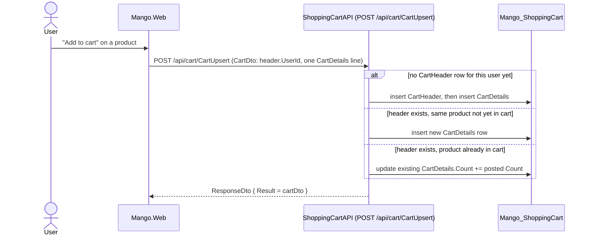

# Workflow: Shopping Cart & Coupons

**Services involved:** `Mango.Web` → `Mango.Services.ShoppingCartAPI` (owns `Mango_ShoppingCart`) → `Mango.Services.ProductAPI` + `Mango.Services.CouponAPI` (read-only, server-to-server)

## Data model

`CartHeader` (`UserId`, `CouponCode`) and `CartDetails` (`CartHeaderId`, `ProductId`, `Count`) are the only persisted rows. `CartHeader.Discount` and `CartHeader.CartTotal` are `[NotMapped]` — computed fresh on every `GetCart` call, never stored, so they can never drift from current product prices and coupon rules (but also mean cart totals are only ever as correct as ProductAPI/CouponAPI's current state at read time).

## Add to cart (`CartUpsert`)



## View cart (`GetCart`)

```mermaid
sequenceDiagram
    participant Web as Mango.Web (CartController)
    participant Cart as ShoppingCartAPI (GET /api/cart/GetCart/{userId})
    participant DB as Mango_ShoppingCart
    participant Product as ProductAPI (GET /api/product)
    participant Coupon as CouponAPI (GET /api/coupon/GetByCode/{code})

    Web->>Cart: GET /api/cart/GetCart/{userId}
    Cart->>DB: load CartHeader + CartDetails for userId
    Cart->>Product: GetProducts() — fetches the FULL catalog\n(forwards caller's bearer token)
    Product-->>Cart: ProductDto[]
    loop each CartDetails line
        Cart->>Cart: item.Product = productDtos.First(p => p.ProductId == item.ProductId)\ncart.CartHeader.CartTotal += Count * Product.Price
    end
    opt CartHeader.CouponCode is set
        Cart->>Coupon: GetByCode(code) — forwards caller's bearer token
        Coupon-->>Cart: CouponDto
        alt CartTotal > coupon.MinAmount
            Cart->>Cart: CartTotal -= DiscountAmount; Discount = DiscountAmount
        end
    end
    Cart-->>Web: ResponseDto { Result = CartDto (with totals) }
```

Note: `GetCart` fetches the **entire product catalog** on every call just to enrich a handful of cart lines — fine at demo scale, worth revisiting before assuming this scales.

## Apply / remove coupon

`Mango.Web/Controllers/CartController.cs` → `POST /Cart/ApplyCoupon` (and `RemoveCoupon`, which just re-posts with an empty code) → `ShoppingCartAPI: POST /api/cart/ApplyCoupon` writes `CouponCode` onto the existing `CartHeader` row. No discount math happens here — applying a coupon just stamps the code; the discount is (re)computed the next time `GetCart` runs, and only takes effect if `CartTotal > coupon.MinAmount` at that time. A coupon that stops qualifying (e.g. after removing an item) silently stops discounting on the next read without any explicit "coupon removed" feedback to the user.

## Remove item

`POST /api/cart/RemoveCart` deletes the `CartDetails` row; if it was the last line for that cart, the `CartHeader` row is deleted too (so an empty cart leaves no trace, and a subsequent `CartUpsert` recreates the header from scratch).

## Email the cart

`Mango.Web: POST /Cart/EmailCart` → `ShoppingCartAPI: POST /api/cart/EmailCartRequest` publishes the current `CartDto` onto the `sbqemailshoppingcart` queue rather than emailing synchronously — see [rewards-and-notifications.md](rewards-and-notifications.md) for the consumer side.

## Checkout hand-off

Checkout (`POST /Cart/Checkout`) reloads the cart server-side (ignoring whatever the posted form's line items say, keeping only `Phone`/`Email`/`Name` from the post) before handing it to `OrderAPI.CreateOrder` — see [checkout-and-payments.md](checkout-and-payments.md).
