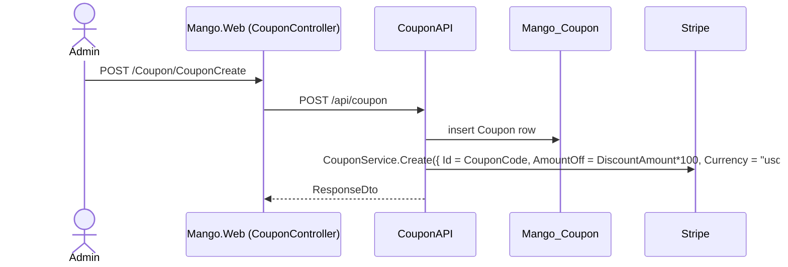

# Workflow: Checkout & Payments (Stripe)

**Services involved:** `Mango.Web` → `Mango.Services.OrderAPI` (owns `Mango_Order`) → Stripe Checkout/PaymentIntent/Refund APIs → Azure Service Bus (on successful payment)

## Checkout → Stripe Checkout → Confirmation

```mermaid
sequenceDiagram
    actor U as User
    participant Web as Mango.Web (CartController)
    participant Order as OrderAPI
    participant DB as Mango_Order
    participant Stripe as Stripe Checkout

    U->>Web: POST /Cart/Checkout (name, phone, email)
    Web->>Web: reload cart server-side, overlay posted contact fields
    Web->>Order: POST /api/order/CreateOrder (CartDto)
    Order->>DB: insert OrderHeader (Status=Pending, OrderTime=now) + OrderDetails\n(prices/names copied as-is from the cart snapshot)
    Order-->>Web: ResponseDto { Result = OrderHeaderDto (with OrderHeaderId) }
    Web->>Order: POST /api/order/CreateStripeSession\n(StripeRequestDto: ApprovedUrl=/cart/Confirmation?orderId=..,\nCancelUrl=/cart/checkout, OrderHeader)
    Order->>Stripe: SessionService.Create(line items from OrderDetails,\ndiscount = coupon code if Discount > 0)
    Stripe-->>Order: Session { Id, Url }
    Order->>DB: OrderHeader.StripeSessionId = session.Id
    Order-->>Web: ResponseDto { Result = StripeRequestDto (with StripeSessionUrl) }
    Web-->>U: HTTP 303 redirect to StripeSessionUrl
    U->>Stripe: completes payment on Stripe-hosted Checkout page
    Stripe-->>U: redirect to ApprovedUrl (or CancelUrl if abandoned)
    U->>Web: GET /Cart/Confirmation?orderId=..
    Web->>Order: POST /api/order/ValidateStripeSession (orderHeaderId)
    Order->>Stripe: SessionService.Get(StripeSessionId) → PaymentIntentService.Get(paymentIntentId)
    alt PaymentIntent.Status == "succeeded"
        Order->>DB: OrderHeader.PaymentIntentId = ...; Status = Approved
        Order->>Order: build RewardsDto { OrderId, UserId, RewardsActivity = round(OrderTotal) }
        Order-)Bus: PublishMessage(rewardsDto, "OrderCreated" topic)
        Order-->>Web: ResponseDto { Result = OrderHeaderDto (Status=Approved) }
        Web-->>U: render confirmation page
    else not succeeded
        Order-->>Web: ResponseDto (Result unset — Status stays Pending)
        Web-->>U: render confirmation page anyway (no explicit failure branch)
    end
```

Key points:
- **Order creation and payment confirmation are two separate, sequential API calls from the browser's redirect chain** — there is no webhook from Stripe back to `OrderAPI`. If the user closes the tab right after paying but before hitting `/Cart/Confirmation`, the order stays `Pending` forever with no reconciliation job to catch it.
- The discount applied at Stripe checkout is the **Stripe Coupon object** matching `OrderHeader.CouponCode` (see [cart-and-coupons.md](cart-and-coupons.md) and the coupon-creation flow below) — Stripe, not `OrderAPI`, does the discount math at payment time; `OrderAPI` only decides *whether* to attach a discount (`if (Discount > 0)`).
- `Mango.Web/Controllers/CartController.cs`'s `Confirmation` action treats "not approved" and "Stripe/network error" identically — it just re-renders the same view with `orderId`, relying on the view to inspect status itself if it wants different messaging.
- The reward-points message fires from `ValidateStripeSession`, i.e. **on confirmed payment**, not on order creation — despite the topic being named `OrderCreated`. See [rewards-and-notifications.md](rewards-and-notifications.md).

## Coupon → Stripe sync (prerequisite for discounts to work at Checkout)

Discounts only work at Stripe Checkout if a matching Stripe `Coupon` object already exists — that happens as a side effect of coupon CRUD in `CouponAPI`, not in `OrderAPI`:



`CouponAPI.Delete` mirrors deletions to Stripe the same way (`service.Delete(obj.CouponCode)`). If these two calls (DB write, Stripe write) ever partially fail, the local `Coupon` row and the Stripe `Coupon` object can drift out of sync — there's no compensating transaction.

## Order status changes (staff/admin actions)

`Mango.Web/Controllers/OrderController.cs` exposes `OrderReadyForPickup`, `CompleteOrder`, and `CancelOrder`, all thin wrappers over `OrderAPI: POST /api/order/UpdateOrderStatus/{orderId}`:

- `ReadyForPickup` / `Completed`: just flips `OrderHeader.Status`.
- `Cancelled`: additionally issues a Stripe `Refund` for `orderHeader.PaymentIntentId` (`RefundReasons.RequestedByCustomer`) **before** flipping status — if the refund call throws, the whole action's `catch` block swallows the exception and silently leaves `Status` unchanged (`_response.IsSuccess = false` is set, but nothing in `OrderController.cs` inspects it beyond the standard success/redirect branch already keyed off `response.IsSuccess`, so the UI does correctly stay on the same page — just with no explicit error message about *why*).

All three actions are unguarded by any `[Authorize(Roles = "ADMIN")]` at the `Mango.Web` layer (only `[Authorize]` is applied at `OrderAPI`'s `UpdateOrderStatus`, which accepts any authenticated caller) — worth confirming this matches intent before exposing these routes broadly, since as written any logged-in customer could hit `POST /Order/CompleteOrder?orderId=<someone else's order>` directly.
