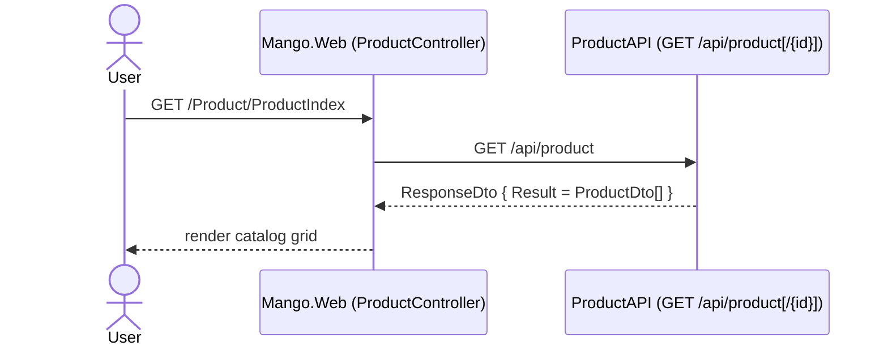
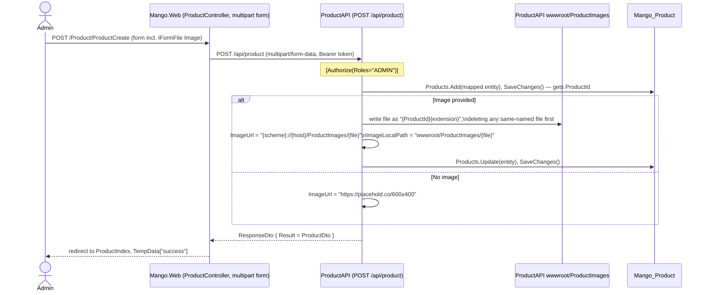

# Workflow: Product Catalog (browse, create/edit with image upload, delete)

**Services involved:** `Mango.Web` → `Mango.Services.ProductAPI` (owns `Mango_Product`, and serves uploaded images from its own `wwwroot/ProductImages`)

## Browse (public)

No `[Authorize]` on the `GET` endpoints — anyone (including unauthenticated `Mango.Web` calls) can list/read products.

## Create with image upload (ADMIN only)

Notes:
- File validation (`Mango.Web/Utility/AllowedExtensionsAttribute.cs`, `MaxFileSizeAttribute.cs`) is applied as data-annotation-style validators on the `Mango.Web` view model — `ModelState.IsValid` must pass before the controller even calls `ProductService`. ProductAPI itself does not re-validate the uploaded file's extension or size.
- The image filename is derived from `ProductId`, so a second upload for the same product **overwrites** the file in place; this is also why edit needs to delete the old file only when the path differs from the new (same) name in practice they're identical, and the explicit delete-then-write in `Post()` is mostly a safety net for orphaned files from a previous delete-then-recreate of the same ID.
- `product.ImageUrl` bakes in the *ProductAPI's own host/port* (`HttpContext.Request.Scheme/Host`) at upload time — if ProductAPI's public URL ever changes, previously stored `ImageUrl` values go stale and must be backfilled; they are not computed at read time.

## Edit (ADMIN only)

Same shape as create, via `PUT /api/product`: if a new `Image` file is posted, the old file at `ImageLocalPath` is deleted first, then the new file is written and `ImageUrl`/`ImageLocalPath` updated. If no new image is posted, `ProductEdit.cshtml` round-trips the existing `ImageUrl`/`ImageLocalPath` as hidden `<input>` fields, so the AutoMapper-mapped entity keeps pointing at the existing file.

## Delete (ADMIN only)

`DELETE /api/product/{id}` — deletes the DB row and, if `ImageLocalPath` is set, deletes the file from `wwwroot/ProductImages` too. There's no reference check against carts/orders that may already contain this product; a subsequent `ShoppingCartAPI.GetCart` enrichment (`productDtos.FirstOrDefault(u => u.ProductId == item.ProductId)`) will return `null` for the deleted product and the next line (`item.Count * item.Product.Price`) will throw a `NullReferenceException` — this is an existing latent bug, not something introduced by normal usage, worth knowing if cart totals ever start 500ing after a product deletion.
