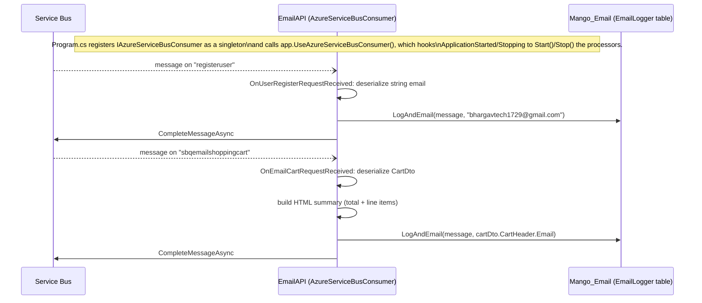
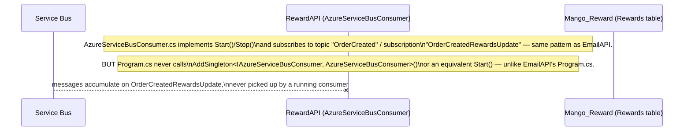

# Workflow: Rewards & Email Notifications (async messaging)

**Services involved:** `Mango.Services.AuthAPI`, `Mango.Services.ShoppingCartAPI`, `Mango.Services.OrderAPI` (publishers) → Azure Service Bus → `Mango.Services.EmailAPI`, `Mango.Services.RewardAPI` (consumers)

All publishing goes through the shared `Mango.MessageBus.MessageBus.PublishMessage(object message, string topic_queue_Name)`, which opens a fresh `ServiceBusClient`/`ServiceBusSender` per call, JSON-serializes the message body (Newtonsoft), and sends it with a random `CorrelationId`.

## Message catalog

| Message | Publisher | Trigger | Queue/Topic | Consumer |
|---|---|---|---|---|
| `string` (email address) | AuthAPI | successful registration | `registeruser` | EmailAPI |
| `CartDto` | ShoppingCartAPI | user clicks "email my cart" | `sbqemailshoppingcart` | EmailAPI |
| `RewardsDto` | OrderAPI | Stripe payment confirmed (`ValidateStripeSession`) | topic `OrderCreated`, subscription `OrderCreatedRewardsUpdate` | RewardAPI *(see caveat below)* |

## EmailAPI consumer

`EmailService.LogAndEmail` only **writes a row to `EmailLoggers`** (`Email`, `Message`, `EmailSent`) — despite the naming, no actual outbound email is sent (no SMTP/SendGrid/etc. integration exists in this project). "Email" here means "recorded as if emailed."

If a handler throws (e.g. malformed message body), the exception is re-thrown from the handler and the message is **not** completed — Service Bus will redeliver it according to the queue's retry/DLQ policy, and `ErrorHandler` just logs the exception to the console.

## RewardAPI — defined, but not currently running

`RewardService.UpdateRewards` (insert into `Rewards`: `OrderId`, `UserId`, `RewardsActivity`, `RewardsDate`) is fully implemented and would work correctly if wired up — the gap is purely in `Mango.Services.RewardAPI/Program.cs` missing the DI registration + `Start()` call that `EmailAPI/Program.cs` has. To fix, mirror `EmailAPI`'s pattern:
1. Register `RewardService` (or its interface) and `IAzureServiceBusConsumer, AzureServiceBusConsumer` in DI.
2. Add an `ApplicationBuilderExtensions.UseAzureServiceBusConsumer()`-equivalent (or inline `IHostApplicationLifetime` hook) that calls `Start()`/`Stop()`.

Until then, `RewardsActivity` messages published by `OrderAPI` are sent into a subscription nothing drains, and the `Mango_Reward` database will stay empty regardless of how many orders are paid for.
